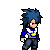

# 🥊 CS304: Fighting Game Project

**Welcome to the simple 2D fighting game project, developed using Java and OpenGL (JOGL).**

This game provides a fast and engaging local multiplayer experience, where two players control their respective characters to execute movements and special attacks.

## 🎮 Key Features

* **Simple 2D Graphics:** Clean and straightforward visuals built upon OpenGL foundations.
* **2-Player Local Multiplayer:** Compete against your friend locally.
* **Diverse Attacks:** Each character has a standard attack and a special (Spacial Attack).
* **Clear Structure:** Organized project files to facilitate expansion and modification.

## 🎯 Character Showcase

The primary combatants in the game are the **Red Fighter (Player 1)** and the **Blue Fighter (Player 2)**.

| Red Fighter (Player 1) | Blue Fighter (Player 2) |
| :--------------------: | :--------------------: |
| **** | **** |

---

## 🚀 Quick Start

To run the game on your system, follow these steps:

1.  **Clone the Repository:**
    ```bash
    git clone [https://github.com/AmrAhmed1210/CS304_Fighting_Project.git](https://github.com/AmrAhmed1210/CS304_Fighting_Project.git)
    cd CS304_Fighting_Project
    ```
2.  **Add JOGL Libraries:**
    * Download the appropriate **JOGL** (Java OpenGL) binaries for your operating system.
    * Add the necessary **`.jar`** files for JOGL to the project's Build Path configuration.
3.  **Run the Game:**
    * Execute the main file: `src/engine/Game.java`.

## 🕹️ Controls

Get ready to fight! Here are the control keys for each player:

### Player 1 (Red Character)

| Action | Key |
| :--- | :--- |
| **Move Left** | `A` |
| **Move Right** | `D` |
| **Move Up** | `W` |
| **Move Down** | `S` |
| **Attack / Shoot Power Ball** | `F` |
| **Spacial Attack** | `G` |

### Player 2 (Blue Character)

| Action | Key |
| :--- | :--- |
| **Move Left** | `← Arrow` |
| **Move Right** | `→ Arrow` |
| **Move Up** | `↑ Arrow` |
| **Move Down** | `↓ Arrow` |
| **Attack / Shoot Power Ball** | `Enter` |
| **Spacial Attack** | `Shift` |

---
## 📁 File and Folder Structure

The project is organized with the following structure:

```
CS304_Fighting_Project/
├── src/
│   ├── engine/
│   │   ├── Game.java           # The main entry point and game loop.
│   │   └── TextureLoader.java  # Responsible for loading graphical resources.
│   └── entities/
│       └── Player.java         # Base class for representing the players.
└── assets/                     # Contains all image files and graphics.
└── (Character images, backgrounds...)
```
## 🛠️ Technical Requirements

* Java Development Kit (JDK) 8 or later.
* JOGL (Java OpenGL) Libraries.

---

## 💡 Areas for Review and Improvement

Based on the current code structure, here are some suggestions for enhancing the project:

1.  **Collision Detection Management:**
    * **Review:** Is collision between power balls and characters calculated accurately? Ensure the hitbox is logically sized relative to the character texture.
    * **Improvement:** Consider creating a separate class to handle collision logic instead of placing it entirely within `Game.java` for better code separation and clarity.
2.  **Attack Abstraction:**
    * **Review:** Are the `F` and `G` attacks (or `Enter` and `Shift`) distinct enough in implementation (e.g., different speed, damage, or visual effects)?
    * **Improvement:** Implement a base `Attack.java` class and derive different attack types (`PowerBallAttack.java`, `SpacialAttack.java`) to easily add new abilities.
3.  **Health Bars:**
    * **Review:** Is the health bar clearly rendered and updated for each player using OpenGL?
    * **Improvement:** Ensure the health bar does not obscure other elements and remains consistently visible on the screen.
4.  **Resource Loading (Texture Loader):**
    * **Review:** Does `TextureLoader.java` efficiently manage resources and prevent repeated loading of the same image?
    * **Improvement:** Use the **Singleton Pattern** in `TextureLoader` or implement a caching mechanism for improved performance.

---
